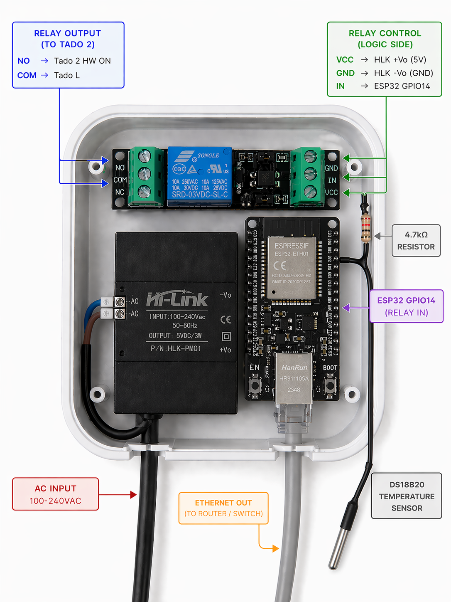
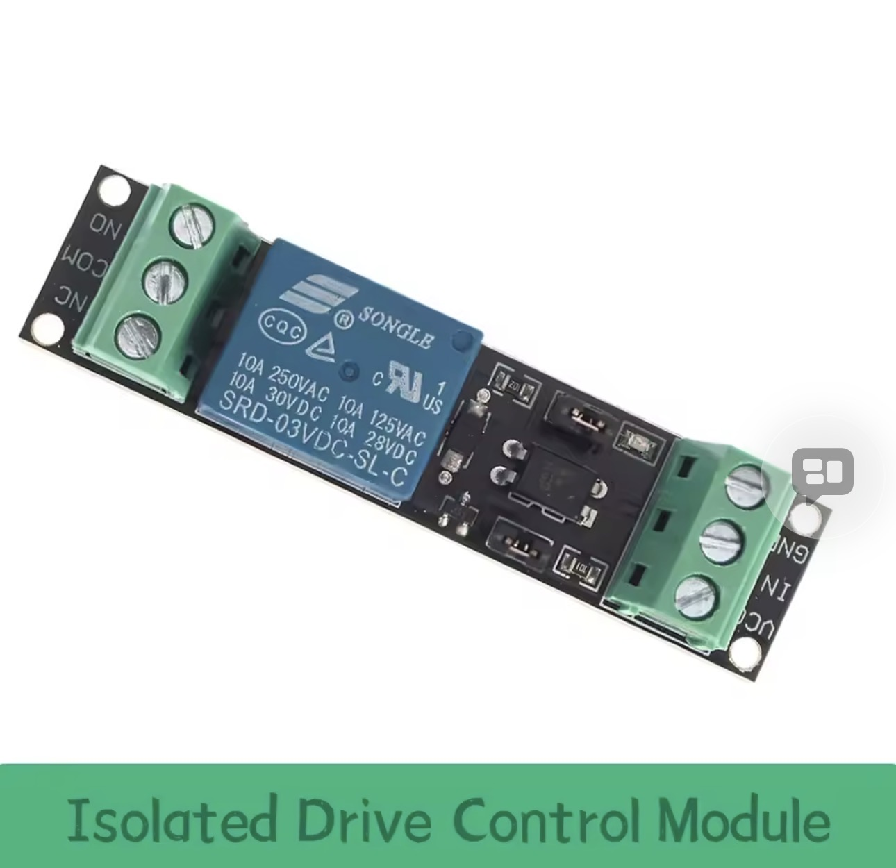
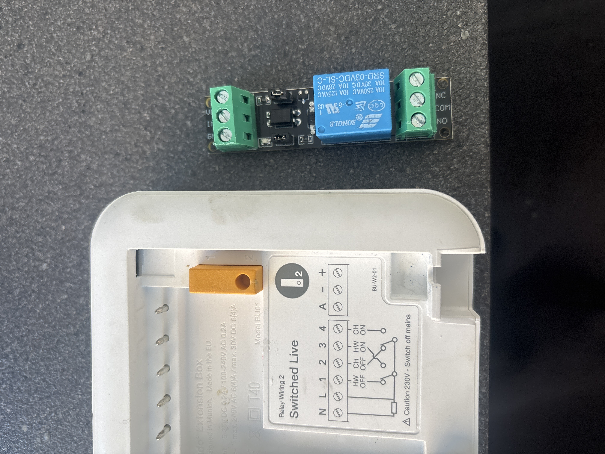
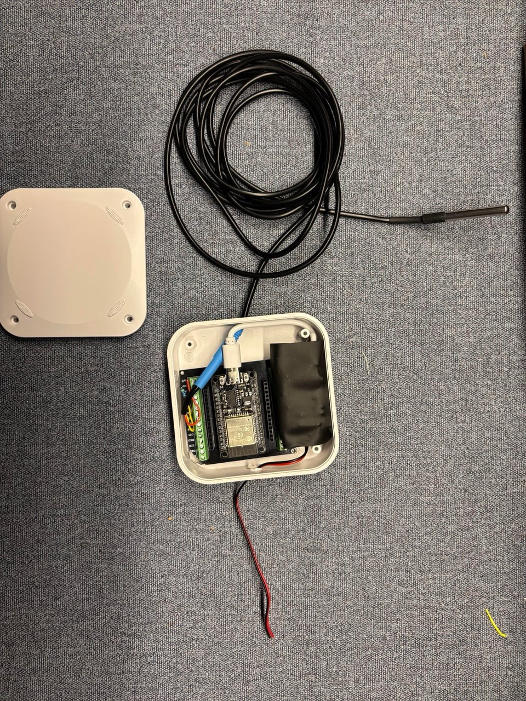
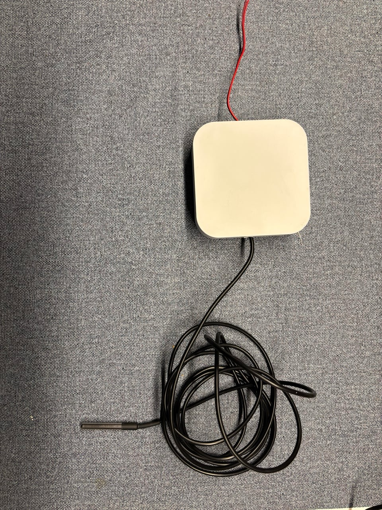

# tadoLocalHotWater (v1.1)
## Local Hot Water Independence + Resilience for Tado-Controlled Hot Water

[](https://esphome.io/)
[](https://www.home-assistant.io/)
[](LICENSE)
[](https://buymeacoffee.com/ay129)
[](https://www.paypal.com/donate?business=nyashachipanga%40yahoo.com&currency_code=GBP)

A small, low-cost project that gives a Tado-controlled hot water system three layers of fallback so the tank doesn't go cold when **Tado's BU01**, **Tado's cloud**, **Home Assistant**, or **the network** drops. Companion project to [tadoHotWaterKnob](https://github.com/ay129-35MR/tadoHotWaterKnob) — same household, complementary problem.

<p align="center">
  
</p>

<p align="center">
  
  <br>
  <em>The single-channel isolated relay that sits in parallel with the BU01's HW-on dry contacts.</em>
</p>

<p align="center">
  
  <br>
  <em>Relay next to the Tado BU01 — COM ↔ NO wired across the same HW-on pair the BU01 already drives.</em>
</p>

---

## Why this exists — the cloud-independence manifesto

Smart-home hardware has a habit of dying long before the appliances it controls. **Google killed Works With Nest in 2019**, stranding entire ecosystems. **Revolv hubs were bricked by a deliberate cloud shutdown in 2016**. Insteon vanished overnight in 2022. Even when the cloud stays up, vendors quietly drop API support for older device generations, leaving working hardware as expensive paperweights — Logitech Harmony, Wink, Iris, Lowe's Iris again, the list keeps growing.

Tado is a healthy company today. The BU01 in your airing cupboard talks to your boiler via short-range radio to a wireless internet bridge that talks to Tado's cloud servers. **Three things have to keep working forever** for that hot tap to deliver: the BU01's radio link, your internet, and Tado's servers. Lose any one of them and you're cold-showering until it comes back.

This project is a small bet against that. It puts a **wired, local, vendor-neutral** parallel path next to the Tado control plane:

- The boiler's HW-call terminals get a second pair of wires from a cheap ESP32 relay running [ESPHome](https://esphome.io/) — open source firmware, no cloud, no account required.
- Decisions are made by [Home Assistant](https://www.home-assistant.io/) — open source, runs on your hardware, no cloud dependency.
- If even Home Assistant goes dark, the ESP32 itself takes over with a tiny survival thermostat — keeping the water usable until you get back to fix things.

Tado keeps doing what it does well — comfort, scheduling, app polish. We just refuse to let it be the *only* path. If Tado vanishes tomorrow the way Nest did in 2019, the boiler still fires, the water still heats, and the only thing you lose is the app.

This is **cable-cutting for your boiler**: not a replacement for the cloud product you've already paid for, but a guarantee that your hot water survives its disappearance.

---

## The problem in concrete terms

The hot water side of a Tado X system has a single point of failure: the **BU01** wireless extension kit on the boiler. It's the only thing that closes the burner contacts for hot water. If it drops off the radio link, or Tado's cloud has a wobble, or Home Assistant decides to die during an upgrade, no hot water — and the Tado app shows everything in red, with nothing the homeowner can do remotely.

Three things were needed without ripping out Tado:

1. **Independence** — a parallel actuator that can fire the boiler without Tado being involved.
2. **Backup brain** — Home Assistant can drive either path; if one path fails, HA still has hands.
3. **Survival** — if HA itself dies, *something* keeps the tank warm enough to use.

…all without ever creating two writers fighting over the same boiler call.

---

## TL;DR — three operating modes

> The whole project is essentially a state machine with three states. Read this table and you understand 80% of what's going on.

| Mode | When | Brain | Actuator | What ETH01 is doing |
|------|------|-------|----------|---------------------|
| **🟢 1 — Normal** | HA alive AND Homebridge alive AND `actuator = tado` | HA automations | **Homebridge switch** (`switch.t_hot_water_boiler`) | sensing tank temp + hard safety only |
| **🟡 2 — Relay** | HA alive but `actuator = relay` (you flipped it) | HA automations | **ETH01 relay** (`switch.hotwatertemp_hot_water_relay`) | sensing tank temp + hard safety only |
| **🔴 3 — Survival** | HA heartbeat to ETH01 stale ≥ 15 min | **ETH01 alone** | **ETH01 relay** | tiny local fallback thermostat |

**Hard safety on the ETH01** — over-temp ≥ 65 °C → OFF + lockout, max-on-time → OFF + lockout, sensor invalid → OFF — is **active in all three modes** regardless of who the brain is. The boiler can never be left on indefinitely or in a dangerous state purely because of a software fault.

**Mode switching:**

- 🟢 Mode 1 ⇄ 🟡 Mode 2 is a **manual flip** of `input_select.hot_water_actuator`. v1 is intentionally manual — automatic actuator failover is a debugging nightmare when it triggers unexpectedly. The `hot_water_on` script does include a pre-flight check (v1.1): if you're set to `tado` but `switch.t_hot_water_boiler` is `unavailable` at the moment of heat demand, it auto-flips to relay and notifies you. You flip back manually when Homebridge recovers.
- 🟢 / 🟡 → 🔴 Mode 3 happens **automatically** — the ETH01 watches its own heartbeat freshness. No HA cooperation required.
- 🔴 → 🟢 / 🟡 happens **automatically** the moment the heartbeat returns.

---

## Hardware & Build Context

The actuation side is intentionally simple: a single relay wired in parallel with the BU01's hot water output. Either device closing fires the burner; both must be open for the boiler to stay off. The intelligence is all in software.

### Where this build started — the sensor-only predecessor

Before the relay path existed, the same enclosure was built out as a **read-only** ESPHome node: just a WT32-ETH01, a 5 V supply, and a DS18B20 probe dropped into the tank's temperature pocket. Its only job was to publish tank temperature into Home Assistant so we could see what Tado was *actually* doing to the cylinder — a trust-but-verify layer on top of the cloud integration, and the companion to [tadoHotWaterKnob](https://github.com/ay129-35MR/tadoHotWaterKnob).

That earlier build is what the v1 you're looking at grew out of: same enclosure, same ESP32, same probe, same wiring for rows 9–11 of the connections table below. All that was added was a relay module and the cable run from COM/NO to the BU01. If you're retrofitting an existing sensor-only install, you already have 80 % of the hardware and most of the cable routing work done.

<p align="center">
  
  <br>
  <em>v0 — sensor-only. Same enclosure, ETH01, probe. No relay yet.</em>
</p>

<p align="center">
  
  <br>
  <em>v0 closed and deployed — feeds tank temperature into HA only.</em>
</p>

### Parts List

| Part | Cost | Notes |
|---|---:|---|
| **WT32-ETH01** ESP32 dev board with built-in 100 Mb Ethernet | ~£8 | Wired LAN — no Wi-Fi flake risk for the safety-critical role. |
| **3.3V relay module** (SSR or small mechanical — 2A is plenty for the BU01's dry contacts) | ~£3 | Active-LOW relays work — invert the GPIO if needed. |
| **DS18B20** in a stainless probe with the standard 4.7 kΩ pull-up | ~£2 | Dropped into the tank's existing temperature port (most cylinders have one). |
| **3-core cable** between the ETH01 and the boiler (relay sits at the boiler end) | <£1 | COM + NO + GND. |
| **Pluggable terminal blocks** for the BU01 dry contacts | <£1 | Avoids cutting into the BU01 itself. |
| **5 V USB power supply** for the ETH01 | ~£3 | Feed it from the same circuit as the BU01 if possible. |
| Total | **~£15** | Tado kit is unchanged. |

### Wiring — the parallel path

The relay's COM and NO contacts go in parallel with the BU01's HW-on output (the dry pair that goes to the boiler's HW call terminals). Either path closing fires the burner.

```
                  ┌───────────────────────┐
                  │  Boiler "HW call"     │
                  │   dry-contact pair    │
                  └─────────┬─────────────┘
                            │
              ┌─────────────┼──────────────┐
              │                            │
   ┌──────────┴──────────┐    ┌────────────┴───────────┐
   │ Tado BU01           │    │ Relay (COM ↔ NO)        │
   │ extension kit       │    │ driven by ETH01 GPIO14  │
   │ (cloud / radio path)│    │ (wired path)            │
   └─────────────────────┘    └─────────────────────────┘
```

There is **no software arbitration at the hardware layer** — that's deliberate. It's then the software's job to stay disciplined. See "How clashes are prevented" below.

### Wiring — the ETH01

- **DS18B20** — see the dedicated section below.
- **Relay control input** wired to GPIO14 (avoids strapping pins).
- **Ethernet** uses the WT32-ETH01's onboard LAN8720 (GPIO0/16/18/23). No Wi-Fi configured.
- Power the ETH01 from the same circuit as the BU01 if practical — they share a failure mode either way.

### Tank temperature — the DS18B20 (the ESP's eye on the cylinder)

The whole safety and survival layer rests on knowing the actual tank temperature independently of Tado. The DS18B20 is the cheapest possible way to get that: a single-wire digital sensor, factory-calibrated to ±0.5 °C across the useful domestic hot-water range (−10 to +85 °C), immune to the analog drift that plagues thermistors, and readable directly by ESPHome with no maths on the ESP side.

Three specific jobs it does:

1. **Hard safety** — ETH01 trips the relay OFF + lockout if it reads ≥ `max_safe_temp` (default 65 °C). Works in all three modes regardless of who's driving the boiler.
2. **Survival thermostat** — in Mode 3, the ETH01's 30-second interval loop compares tank temp to the survival band and cycles the relay with 3-minute anti-chatter.
3. **Observability** — publishes `sensor.hotwatertemp_hot_water_tank_temperature` to HA, so every automation, dashboard card, and the external watchdog can see the same ground-truth reading.

**Form factor.** Use the **stainless-steel probe version** on ~1 m of 3-core cable, not the bare TO-92 package. Domestic cylinders have a temperature-sensor pocket on the side (the Tado kit or an immersion thermostat usually occupies the primary one — secondary pockets are common). The probe slides straight in; the stainless sleeve is fine with the tank temperatures involved. Don't strap it to the outside of a lagged tank — you'll read the jacket, not the water, and the survival band will misbehave.

**Bus mode — external power, not parasitic.** Run the sensor in **3-wire mode** (VDD, DQ, GND — all three cores used). Parasitic mode (2-wire, VDD tied to GND at the sensor) is supported by the chip and tempting for retrofit, but it's measurably slower, flakier on long cables, and offers no real benefit here — you already have three conductors in the cable you're running. External-power mode is what ESPHome's `one_wire` platform assumes by default.

**The 4.7 kΩ pull-up.** Required on the data line. The DS18B20 drives DQ low to signal; between transactions DQ must be pulled high to VDD through a 4.7 kΩ resistor. Many probe modules come with this pre-installed on a tiny carrier PCB at the ESP end — if yours doesn't, solder one between GPIO4 and 3.3 V at the ETH01 (not at the tank end). Without it you get `nan` readings and the ESP will cut power out of safety (`sensor bad → OFF`, see "Hard safety" above).

**Wiring (colour conventions vary — check your cable):**

| DS18B20 pin | Typical colour | WT32-ETH01 |
|---|---|---|
| VDD | Red | **3.3 V** |
| GND | Black | **GND** |
| DQ (data) | Yellow (or white) | **GPIO4**, with a 4.7 kΩ pull-up to 3.3 V |

```
    ┌──────────────┐                  ┌───────────────┐
    │  DS18B20     │                  │  WT32-ETH01   │
    │  (in pocket) │                  │               │
    │              │     VDD (red) ───┤ 3.3 V         │
    │              │     GND (blk) ───┤ GND           │
    │              │     DQ  (yel) ───┼─ GPIO4        │
    │              │                  │    │          │
    └──────────────┘                  │    └── 4.7 kΩ │
                                      │        │       │
                                      │       3.3 V    │
                                      └───────────────┘
```

**ESPHome config (already in `esphome/hotwatertemp.yaml`):**
```yaml
one_wire:
  - platform: gpio
    pin: GPIO4

sensor:
  - platform: dallas_temp
    name: "Hot Water Tank Temperature"
    id: hotwatertemp32
    update_interval: 30s
```

**Why not a thermistor / NTC?** The DS18B20 ships pre-calibrated, is a drop-in digital reading, and doesn't need an ADC channel (which on ESP32 has its own Wi-Fi-related quirks). For ~£2 it removes an entire analog calibration dance.

**Multi-sensor note.** The `one_wire` bus supports many DS18B20s on the same pair. If you also want to read flow-pipe temperature or a secondary tank point, add more `platform: dallas_temp` entries with unique `address:` values. For v1 we only use one.

### Pinout (WT32-ETH01)

| Function | GPIO | Notes |
|---|---:|---|
| DS18B20 (one-wire) | GPIO4 | Single sensor, 4.7 kΩ pull-up to 3.3 V. |
| Relay control | GPIO14 | Active-HIGH. `restore_mode: ALWAYS_OFF`. |
| Ethernet MDC | GPIO23 | LAN8720 reserved. |
| Ethernet MDIO | GPIO18 | LAN8720 reserved. |
| Ethernet CLK_EXT_IN | GPIO0 | LAN8720 reserved. |
| Ethernet PHY power | GPIO16 | LAN8720 reserved. |

### All connections — full wiring table

Every conductor in the build, end-to-end. Use this as a tick-list when you're at the boiler with a screwdriver.

| # | From (device · terminal) | To (device · terminal) | Conductor | Purpose / notes |
|---|---|---|---|---|
| 1 | Mains consumer unit · Live (230 V AC) | Hi-Link HLK-PM01 AC-DC module · L (AC IN) | Brown (live) | Powers the 5 V rail. Spur off the same circuit as the BU01 if practical. |
| 2 | Mains consumer unit · Neutral | Hi-Link HLK-PM01 · N (AC IN) | Blue (neutral) | Same spur as above. |
| 3 | Mains consumer unit · Earth | Enclosure earth stud / DIN rail | Green-yellow | Earth the metal enclosure if metallic. PSU is double-insulated, no earth required on the PSU itself. |
| 4 | Hi-Link HLK-PM01 · +5 V | WT32-ETH01 · 5 V | Red | ESP32 + Ethernet PHY power. |
| 5 | Hi-Link HLK-PM01 · GND | WT32-ETH01 · GND | Black | Common ground with everything else on the ESP side. |
| 6 | WT32-ETH01 · 3.3 V | Relay module · VCC | Red (flyable) | Relay coil driver rail (isolated board, 3.3 V logic side). |
| 7 | WT32-ETH01 · GND | Relay module · GND | Black | Logic-side ground. |
| 8 | WT32-ETH01 · GPIO14 | Relay module · IN | Yellow / signal | Active-HIGH trigger. `restore_mode: ALWAYS_OFF`. |
| 9 | WT32-ETH01 · 3.3 V | DS18B20 probe · VDD (red) | Red | 3-wire / external-power mode. |
| 10 | WT32-ETH01 · GND | DS18B20 probe · GND (black) | Black | Sensor ground. |
| 11 | WT32-ETH01 · GPIO4 | DS18B20 probe · DQ (yellow) | Yellow / data | One-wire data line. **Fit 4.7 kΩ pull-up between GPIO4 and 3.3 V at the ESP end.** |
| 12 | Relay module · COM | Tado BU01 · HW-on terminal A (matches BU01's existing HW dry pair) | 3-core cable core 1 | The wire landing on the *same* BU01 screw as the existing HW call wire. |
| 13 | Relay module · NO | Tado BU01 · HW-on terminal B | 3-core cable core 2 | Lands on the other HW dry terminal. Either path (BU01 or relay) closing the COM↔NO pair fires the burner. |
| 14 | — | — | 3-core cable core 3 (GND) | Reserved / spare. If you want to guarantee relay-side galvanic isolation from the boiler side, leave unconnected. Not required for operation. |
| 15 | WT32-ETH01 · RJ45 jack | Router / switch · LAN port | Cat-5e/6 Ethernet patch | 100 Mb. Full LAN — no DHCP tricks required; a static IP is nice-to-have. |

Notes:
- The "3-core cable" in rows 12–14 is the run **from the relay (inside the ETH01 enclosure) down to the boiler's BU01 backplate**. Use proper multi-core flex, not single-core doorbell wire.
- Rows 12 and 13 are electrically in parallel with the BU01's own internal HW-on contact — *that is the whole point*. You are adding a second path across the same pair; you are not cutting anything.
- Rows 4 and 5 are what you get from the Hi-Link module. If you use a USB 5 V adapter instead, the polarity is the same: VBUS to 5 V, GND to GND.
- The DS18B20 probe cable (rows 9–11) runs from the ETH01 enclosure to the cylinder's temperature pocket. 1 m is usually plenty; longer runs may need the pull-up lowered slightly (2.2 kΩ) for signal integrity, but 4.7 kΩ is correct for the ≤ 3 m the typical install needs.

### Summary

- **Two 230 V wires in** (L, N) to a Hi-Link PSU → **5 V out** to the ETH01.
- **Three wires** from ETH01 to the relay module (3.3 V, GND, GPIO14 signal).
- **Three wires** from ETH01 to the DS18B20 probe (3.3 V, GND, GPIO4 data + **4.7 kΩ pull-up to 3.3 V**).
- **Two wires** from the relay's COM/NO terminals to the BU01's existing HW-on pair — **in parallel**, not in series. Either path fires the boiler; both must open to keep it off.
- **One Ethernet patch** from the ETH01's RJ45 to your LAN. No Wi-Fi.

Total wires landed at the BU01: **two**. Total wires landed at the ETH01: **eight** (2 × power in, 3 × relay, 3 × sensor). Total serviceable parts: **four** (Hi-Link, ETH01, relay module, DS18B20 probe).

### Why a wired ESP for the safety role?

Wi-Fi is the most common failure mode on hobbyist ESPHome devices. Putting the safety-critical relay on a wired Ethernet board costs about £3 more than a generic ESP32 dev board and removes an entire class of issue. The BU01 itself is wireless (Tado's 868 MHz mesh) so the relay is the wired, deterministic alternative — exactly what you want for a fallback.

---

## How clashes are prevented

**One actuator selector** + **two wrapper scripts**:

```yaml
hot_water_on:
  pre-flight: if actuator=tado and switch unavailable → flip to relay + notify
  if actuator == relay: relay ON, force Tado switch OFF
  else:                 Tado ON, force relay OFF

hot_water_off:
  Tado switch OFF
  relay OFF        # always both, regardless of selector
```

Every existing HA automation (turn-on, turn-off fail-safe, trip-catch, schedule, derate-overnight, towel-rail handler, iOS critical-alert action) is **minimally refactored** to call these scripts instead of toggling `switch.t_hot_water_boiler` directly. Roughly 5 line edits, no actual logic redesign — the wrappers become the single mux point for the entire control surface.

**The trade-off**: anything that bypasses the wrapper (Tado's own schedule, the Tado app, a stray `switch.turn_on` somewhere) can briefly desynchronise the two paths. HA's fail-safe off-cycle and the ETH01's max-on-time ultimately bound the damage — but discipline matters.

> **Critical detail (v1.1 bug fix):** The Turn-Off Fail-Safe condition must check **both** actuator paths, not just the Tado/Homebridge one. The original v1.0 predicate only checked `switch.t_hot_water_boiler`. When `actuator = relay`, that switch is forced OFF, so the predicate never passed — the relay ran until the ETH01's own `max_on_seconds` watchdog tripped it (90 min later). Three lockouts in 48 h were caused by this single oversight. The fix: OR both switches in the condition.

---

## Survival mode (the interesting bit)

Home Assistant publishes a **heartbeat** to the ETH01 every 2 minutes via an ESPHome service:

```yaml
- service: ha_heartbeat
  then:
    - lambda: 'id(ha_heartbeat_ms) = millis();'
```

…and the ETH01's **survival band** via a second service, every hour and on change. As of v1.1, these thresholds are **auto-derived from your target temp** (`input_number.target_temp`) rather than stored in separate helpers:

```yaml
low_temp:  "{{ [target - 8, 38] | max }}"   # floor never drops below 38 °C
high_temp: "{{ target }}"                    # survive to your actual setpoint
max_safe_temp: 65 °C                         # hard ceiling (firmware-enforced)
max_on_seconds: 90 min                       # watchdog trip time
```

This means if you derate overnight to 38 °C, the survival band narrows automatically — no separate survival helpers to keep in sync.

When the heartbeat goes stale (>15 min on the ETH01's own clock), the device's interval lambda kicks in:

- below `fallback_low` → relay ON (with 3-min anti-chatter)
- above `fallback_high` → relay OFF
- temp ≥ `max_safe_temp` → OFF + lockout (manual clear from HA or ETH01 web UI)
- relay on > `max_on_seconds` → OFF + lockout
- sensor invalid → OFF (no lockout, auto-resumes)

It deliberately **does not try to be smart**. No occupancy, no schedules, no usage-rate logic. Just keep the water usable until HA comes back.

**Killswitch gates survival (v1.1):** If you turn off `input_boolean.hot_water_automation_enabled` (the master killswitch — used when leaving the house for several days), the survival config published to the ETH01 has `enabled: false`. This means HA rebooting during your absence won't leave the ETH01 autonomously cycling the relay when you intended heating to be off.

The thresholds get clamped defensively on the ESP — if HA pushes a config where `low > high`, the lambda coerces it to a sane band rather than rejecting outright. Survival logic always has *some* usable threshold pair.

---

## ETH01 web UI — bidirectional controls (v1.1)

The ETH01 runs a lightweight web server (`web_server: port 80`). In v1.0, this was read-only: you could see sensor readings and relay state, but couldn't change anything from the browser.

**v1.1 adds three writable controls with full bidirectional sync:**

| Control | Range | HA counterpart | Notes |
|---------|-------|----------------|-------|
| **Target Temp** | 40–65 °C | `input_number.target_temp` | Changing either end propagates to the other |
| **Automations Enabled** | on / off | `input_boolean.hot_water_automation_enabled` | Toggle on ETH01 UI flips the HA helper and vice versa |
| **Survival Allowed** | on / off | `input_boolean.hot_water_survival_enabled` | Enable/disable ETH01 survival mode independently |

Each control uses a **suppress-flag pattern** to prevent echo loops:

```yaml
# HA → ETH01: subscriber sets suppress flag before mirroring the new value
- platform: homeassistant
  entity_id: input_number.target_temp
  on_value:
    then:
      - lambda: |-
          id(suppress_target_push) = true;
          auto call = id(target_temp_local).make_call();
          call.set_value(x);
          call.perform();
          id(suppress_target_push) = false;

# ETH01 → HA: on_value only fires back to HA if suppress is false
number:
  - platform: template
    id: target_temp_local
    on_value:
      then:
        - if:
            condition:
              lambda: 'return !id(suppress_target_push);'
            then:
              - homeassistant.service:
                  service: input_number.set_value
                  data:
                    entity_id: input_number.target_temp
                    value: !lambda 'return x;'
```

The ETH01 web UI is accessible at `http://<static-ip>/` — no app, no cloud, no account. In an emergency (HA down, Homebridge down), you can still reach the device directly from any browser on your LAN, read the tank temperature, see relay state, and adjust the target or toggle survival mode.

---

## The "HA dead + Tado still firing" gap (optional watchdog)

> **You can completely skip this section and still have a perfectly resilient system.** The three operating modes above already cover Tado failure and HA failure. The watchdog only adds out-of-band notification for the rare combined scenario where **HA is down AND Tado is still firing the boiler from its own schedule**. That's a real risk (the tank could overheat before anything intervenes — the ETH01 can shut its own relay but has no wire to Tado), but it's also rare enough that some users will reasonably decide it's not worth the extra moving part.

If you do want it, `watchdog/` contains ~90 lines of Python that:

- polls HA's `/api/` and the ETH01's REST endpoint every 60 s, **completely independently of HA**, and
- pushes via [ntfy.sh](https://ntfy.sh) when HA has been unreachable for 10+ min AND the tank is rising ≥3 °C from baseline (or ETH01 is also unreachable — total blackout).

Notification path is **fully outside HA**, so it works when HA is exactly the thing that's broken. Pick an unguessable ntfy topic — anyone subscribed gets the alerts.

### Where to run it — pick whatever suits you

The watchdog is intentionally simple Python so you can host it on whatever you already have running. Some options, in roughly increasing isolation from HA:

| Option | Pros | Cons |
|---|---|---|
| **A separate Raspberry Pi Zero / Pi 4 / similar SBC** | Maximum independence — different machine, different SD card, different power supply. The "watchdog watches the watchdog" archetype. | One more box to maintain. ~£15–£35 for the Pi. |
| **An always-on Linux box / NAS / homelab server** | Zero new hardware if you already have one. Survives HA going down because it's a different machine. | Same room/circuit/UPS as HA — shared physical-failure modes. |
| **A Docker container on the same host as HA** *(this repo's reference setup)* | Easiest if you already run other Dockerised services. Trivial to update. | Same kernel and host as HA — won't help if the host itself dies. |
| **A cron job on a router with entware/openWRT** | Independent power domain, different uptime profile. | Limited Python availability, awkward to update. |
| **A free-tier VPS or a friend's home Pi over Tailscale** | True off-site independence — survives a power cut at your house. | Now you depend on internet round-trip and a third party for the safety alert. |

The principle to optimise for: **the watchdog should fail in a different way than HA fails.** Different machine is good. Different power supply is better. Different physical location is best. But all of them are dramatically better than nothing.

---

## The native Tado HA integration — why it's excluded from v1.1

The original v1.0 README recommended **re-enabling the native Tado HA integration** alongside Homebridge to get `binary_sensor.hot_water_connectivity` — the only reliable signal that the BU01 was unreachable end-to-end. **v1.1 removes this recommendation entirely.**

Here's what happened in practice:

1. The native Tado HA integration uses **OAuth 2.0 Device Authorization** (since March 2025). Tokens expire without prominent warning. Re-auth requires approving a code in the HA UI; if this slips past you, `binary_sensor.hot_water_connectivity` goes stale and the advisory automations start firing on wrong data.
2. Two separate incidents resulted in cold water because the advisory automation had made routing decisions based on a broken sensor — the integration was unhealthy, but the automation didn't know that.
3. Homebridge (`platform: homekit_controller`) had been driving `switch.t_hot_water_boiler` reliably for months with zero issues. It was never the problem.

**The decision:** The native Tado HA integration adds `binary_sensor.hot_water_connectivity` at the cost of OAuth fragility and a whole extra set of advisory automations that can misbehave. Homebridge handles actuation cleanly. The trade-off isn't worth it.

**What you lose:** An early-warning signal when the BU01 goes dark before it affects heating.

**What you gain:** An actuation and advisory layer that doesn't silently fail from OAuth expiry.

**If you still want BU01 monitoring:** Run the external watchdog (`watchdog/`). It polls the ETH01's REST endpoint and Tado's cloud status directly — completely outside HA, completely outside the integration. That's a better monitoring path anyway, because it works when HA is exactly the thing that's broken.

---

## Repository layout

```
tadoLocalHotWater/
├── README.md
├── LICENSE
├── esphome/
│   └── hotwatertemp.yaml              # WT32-ETH01 firmware (globals, services, safety+survival lambda,
│                                      #   bidirectional web UI controls added in v1.1)
├── homeassistant/
│   ├── configuration.yaml.snippet     # input_select / boolean / number helpers
│   ├── scripts.yaml                   # hot_water_on (with pre-flight) / hot_water_off wrappers
│   └── automations.yaml               # heartbeat publisher, survival config publisher (v1.1),
│                                      #   safe-default-on-restart, refactoring template
├── observer/
│   ├── observer.py                    # Snapshot writer for a homepage widget — NO actuation
│   └── hot-water-observer.service     # systemd unit
├── watchdog/
│   └── watchdog.py                    # External HA-independent watchdog with ntfy.sh push
├── dashboard/
│   └── lovelace-hot-water-view.yaml   # Drop-in Lovelace view
├── docs/
│   └── (additional notes)
└── images/
    ├── 00a-predecessor-open.jpg      # v0 sensor-only build, enclosure open
    ├── 00b-predecessor-closed.jpg    # v0 sensor-only build, closed & deployed
    ├── 01-enclosure-overview.png     # Annotated v1 enclosure build
    ├── 02-relay-module.jpg           # The isolated relay module used
    └── 03-relay-vs-bu01.jpeg         # Relay beside BU01 showing HW-on pair
```

---

## Installation

1. **Flash the ETH01** with `esphome/hotwatertemp.yaml`. Edit the placeholders (`api.encryption.key`, `ota.password`, `static_ip`) for your install.
2. **Wire the relay** in parallel with the BU01's HW-on terminal. COM ↔ NO across the two terminals on the BU01 that already go to the boiler's HW call input.
3. **Add the helpers** from `homeassistant/configuration.yaml.snippet` to your HA config.
4. **Add the wrapper scripts** from `homeassistant/scripts.yaml`.
5. **Add the new automations** from `homeassistant/automations.yaml`.
6. **Refactor your existing hot water automations** to call `script.hot_water_on/off` instead of toggling `switch.t_hot_water_boiler` directly. Look at the "REFACTORING TEMPLATE" comment block at the bottom of `automations.yaml`.
7. **(Optional) Add the dashboard view** from `dashboard/lovelace-hot-water-view.yaml`.
8. **(Optional, and you can happily skip this entirely)** Run the **observer** (`observer/`) for a status snapshot, and/or the **external watchdog** (`watchdog/`) for HA-independent push alerts. The three operating modes already give you the resilience; the watchdog is purely about being *told* when the rare combined-failure scenario happens. See "The 'HA dead + Tado still firing' gap" above for a discussion of where to host it.

**Note on the native Tado HA integration:** v1.1 does **not** require it and recommends you don't install it. Homebridge handles actuation; the external watchdog handles monitoring. See the "Why it's excluded" section above.

---

## Lessons / things I'd do again

- **Don't mirror; mux.** An earlier draft had Tado → relay continuous mirroring. Two writers are always worse than one. An actuator selector + tiny wrapper scripts is much smaller code AND much more obvious during incidents.
- **Survival mode is a service-preservation tool, not a comfort controller.** Resisting the urge to put occupancy, schedules, and usage-rate logic on the ESP kept the survival code under 60 lines and easy to reason about.
- **Manual actuator selection beats auto-failover for v1.** You can always add the automation later; you can't undo a failover that flipped at the wrong moment. The pre-flight check in `hot_water_on` is as far as auto-recovery should go.
- **Hardware safety on the ESP regardless of mode.** Over-temp, max-on-time, sensor-bad must trip on the device, never delegated to HA. Lockout requires manual clear so a transient sensor blip doesn't oscillate the boiler.
- **Check ALL actuator paths in your Turn-Off predicate.** The fail-safe only checked `switch.t_hot_water_boiler`. When `actuator = relay`, that switch is forced OFF, so the predicate was permanently false — the relay ran until the firmware watchdog hit. OR both paths. This is the kind of bug that sits undetected until the failure mode happens, and then it looks like a hardware fault.
- **One external watchdog goes a long way.** ~90 lines of Python, slots into anything you already have running, gives you the only signal that survives HA dying.
- **Don't run the native Tado HA integration if you only need one entity from it.** Homebridge handles the switch reliably. OAuth-based integrations add a fragile re-auth dependency that breaks silently. If you need BU01 monitoring, run the external watchdog instead — it polls the same information without the OAuth complexity.
- **Add bidirectional sync to the ETH01 web UI early.** Read-only diagnostics are fine for a sensor node. Anything you might need to set from the boiler room (target temp, disable survival, kill automations) should be writable. It's ~20 lines of ESPHome and you'll be glad of it the first time HA is down and you need to change something from a browser on your phone.
- **Wired Ethernet for the safety-critical ESP.** A few extra pounds, removes Wi-Fi as a failure mode entirely.

---

## What changed in v1.1

> Released 2026-04-25. All changes in `esphome/`, `homeassistant/`, and `README.md`.

**Bug fixes:**
- **Turn-Off Fail-Safe predicate** now ORs both actuator paths: `is_state('switch.t_hot_water_boiler', 'on') or is_state('switch.hotwatertemp_hot_water_relay', 'on')`. The v1.0 predicate only checked the Homebridge path — when `actuator = relay`, the fail-safe never triggered and the relay ran until the firmware watchdog tripped. Three lockouts in 48 h traced to this single line.

**New features:**
- **ETH01 bidirectional web UI controls** — Target Temp (40–65 °C number), Automations Enabled (switch), Survival Allowed (switch). All three sync two-ways with their HA counterparts via a suppress-flag pattern. The ETH01 web UI (`http://<static-ip>/`) is now useful in a total HA outage.
- **Survival thresholds auto-derived from target temp** — `low = max(target − 8, 38)`, `high = target`. No separate `input_number.hot_water_survival_low/high` helpers to configure or drift.
- **Killswitch gates ETH01 survival** — `input_boolean.hot_water_automation_enabled = off` now also pushes `enabled: false` to ETH01 survival config. HA rebooting during an away period won't leave the ETH01 autonomously cycling the relay.
- **Pre-flight Homebridge check in `hot_water_on`** — if `actuator = tado` but `switch.t_hot_water_boiler` is `unavailable` at the moment of heat demand, the script silently flips to relay, notifies you, and proceeds. Prevents cold water from a dead-Homebridge silent failure.

**Removed:**
- Native Tado HA integration dependency (`platform: tado`) — see "Why it's excluded" section.
- `hot_water_tado_unavailable_advisory` automation.
- `hot_water_unmanaged_scenario_warning` automation.

---

## What's not in v1.1

- **Auto actuator-flip on Homebridge disconnect.** The pre-flight check in `hot_water_on` catches a dead path at the moment of heat demand; beyond that, switching is intentionally manual. Auto-failover is a nightmare to debug when it fires unexpectedly.
- **Rich HA scheduling on the ESP in survival mode.** Out of scope and will stay out — if HA is down for long enough that it matters, fix HA.

---

## Related projects

- [tadoHotWaterKnob](https://github.com/ay129-35MR/tadoHotWaterKnob) — the user-facing knob + display companion to this fallback layer. Same household, different layer.
- [esphome-display-screenshot](https://github.com/ay129-35MR/esphome-display-screenshot) — custom ESPHome component used on the knob.

---

## License

MIT — see [LICENSE](LICENSE). No warranty; this controls a boiler, please verify your wiring, your safety thresholds, and your insurance.

---

If this saved you a cold shower, [buy me a coffee](https://buymeacoffee.com/ay129) ☕ or [drop a tip](https://www.paypal.com/donate?business=nyashachipanga%40yahoo.com&currency_code=GBP) — thanks for reading.
